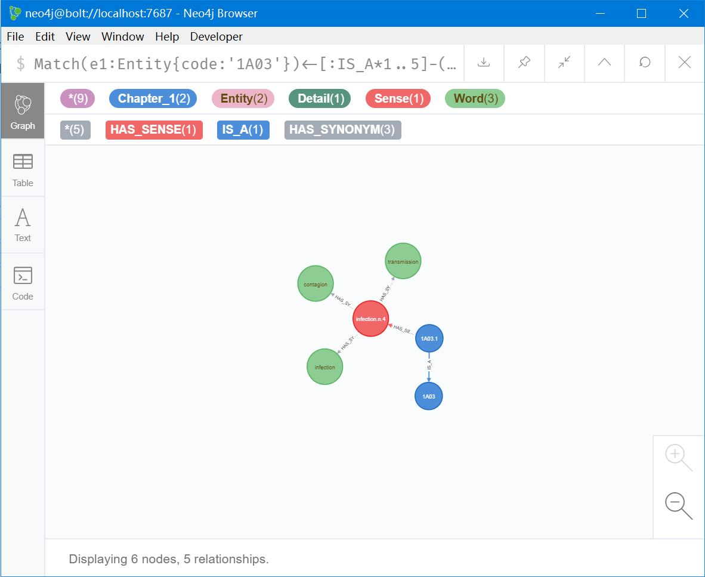
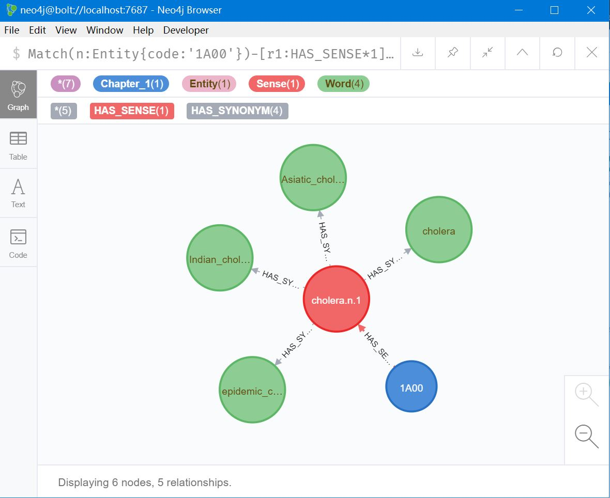
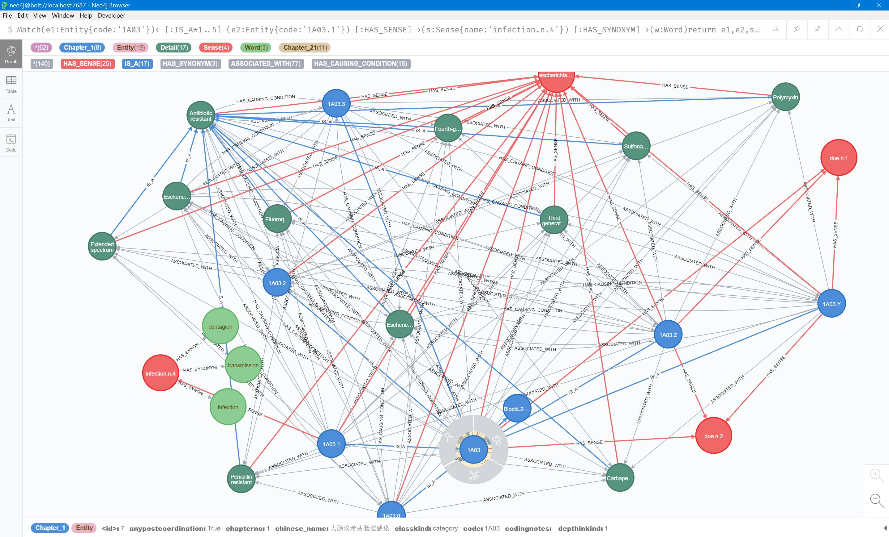
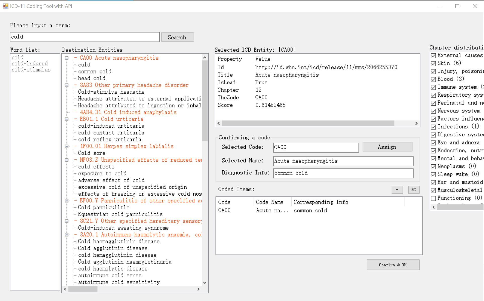

# Computer-assisted coding of ICD-11
This project hosts my research on studying computer-assisted ICD-11 coding systems. It includes relevant datasets we used, references, publicly available source codes and tools.

We aim to faciliate computer-assisted coding of ICD-11 with the use of text semantics. 

## ICD-11 graph databases
1. English version of ICD-11 graph
2. English and Chinese version of ICD-11 graph

Note: the datasets can be imported into Neo4j graph databases using the neo4j-admin command

## WordNet graph databases
1. English WordNet
2. Chinese Open WordNet (COW)

Note: the datasets can be import into Neo4j graph databases

## ICD-11 coding tool using WHO's API
The tool leverages searching abilities of WHO's ICD-11 API to obtain relevant ICD-11 entities. 

Note: This coding tool based on API 1.0 is kinda out-of-date since WHO released API 2.0, which has major changes. But it could be easy to adapt these changes.

## Computer-assisted ICD-11 coding using text semantics 
We leverage semantics in WordNet, an English semantic dictionary, to facilitate computer-assisted coding of ICD-11.

## Publications

[1] D. Chen, R. Zhang, and R. G. Qiu, "Leveraging semantics in WordNet to facilitate the computer-assisted coding of ICD-11," IEEE Journal of Biomedical and Health Informatics, Oct. 2019, Early Access.

[2] D. Chen, R. Zhang, H. Zhao, and J. Feng. "A Bibliometric Analysis of the Development of ICD-11 in Medical Informatics," Journal of Healthcare Engineering, 2019, vol. 2019, Art. no. 1649363.

## Risk
Since the research is of theory, please be responsible for any risk on using the data and algorithms in actual medical coding. 

## Contributors
<a href='https://icd.who.int/ct11/icd11_mms/en/release'>WHO's ICD-11 Online Coding Tool</a> 
<a href='https://icd.who.int/en'>ICD-11 Home Page</a> 
<a href='https://icd.who.int/icdapi'>ICD-11 API</a> 
<a href='https://wordnet.princeton.edu/'>WordNet</a> 
<a href='http://compling.hss.ntu.edu.sg/cow/'>Chinese Open WordNet</a> 

## Licenses
see  <a href='LICENSE'>Apache 2.0 License</a>
